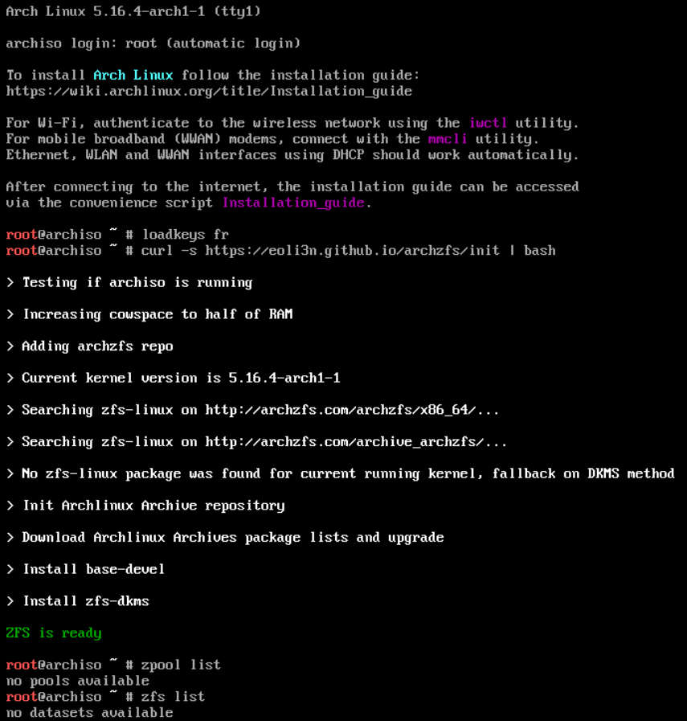

### Why this

If you want to install Archlinux on ZFS, you need to deal with the [ZFS licensing problem](https://wiki.archlinux.org/index.php/ZFS). The kernel module isn't included in the default archiso image, you need to [include it](https://wiki.archlinux.org/index.php/ZFS#Embed_the_archzfs_packages_into_an_archiso) into a custom archiso image to be able to install ZFS.

I wrote an article about [archiso netbooting](https://eoli3n.github.io/2020/04/25/recovery.html).  
This script lets you include the zfs kernel module on any archiso image without creating a custom one.

### Archzfs

The [Archzfs](https://github.com/archzfs/archzfs/wiki) unofficial user repository offers multiple ways to install the ZFS kernel module.  
We can install precompiled module with ``zfs-linux`` package or compile the zfs module using [DKMS method](https://wiki.archlinux.org/index.php/ZFS#DKMS).  
In order to build the module, DKMS needs the ``linux-headers`` package for the running kernel.

### How does it work

It extracts running kernel version and try to find a matching ZFS module in ``Archzfs`` repositories.
If it doesn't, it fallbacks to the DKMS build of the ZFS module.
In that case, the script uses [Arch Linux Archive](https://wiki.archlinux.org/index.php/Arch_Linux_Archive#How_to_restore_all_packages_to_a_specific_date) to install the ``linux-headers`` and ``base-devel`` packages required for DKMS. You need at least ~6Gb RAM to use that method to be able to store packages in cowspace.

In some very specific cases, you won't be able to get ZFS module working for a specific archiso version.  
In that case, just switch to the previous month iso.

### How to use

Boot on any archiso system, and run:
```
$ curl -s https://eoli3n.github.io/archzfs/init | bash
```



### Debug

To run the script in verbose mode, use:
```
$ curl -s https://eoli3n.github.io/archzfs/init | sed 's- &>/dev/null--' | bash &> debug.log
```

### Dev

```bash
$ loadkeys fr
# In pacman.conf, comment SigLevel line
# Set "SigLevel = Never"
$ pacman -Syy git
# In pacman.conf, restore Siglevel line
```

### Related

- [Archzfs issue : Dynamically build/load ZFS module on default archiso #337](https://github.com/archzfs/archzfs/issues/337)
- [Archlinux Wiki : Install Arch Linux On ZFS](https://wiki.archlinux.org/index.php/Install_Arch_Linux_on_ZFS#Get_ZFS_module_on_archiso_system)
